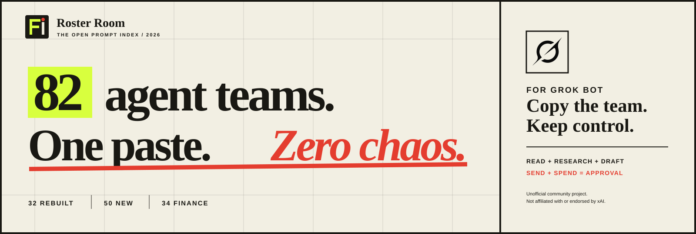

  

# Roster Room Prompts

**82 complete, copy-paste agent-team setups for Grok Bot.**

This repository contains prompts only. There is no application, build system, TypeScript, package installation, or runtime dependency.

> Unofficial community project. Not affiliated with or endorsed by xAI.

## The library

- [`prompts/rebuilt`](prompts/rebuilt) — 32 common operating teams rebuilt with new names, clear ownership, and human approval gates.
- [`prompts/new`](prompts/new) — 50 additional teams for founders, revenue, operations, security, communications, finance, hedge funds, and quantitative trading desks.

Every file contains:

1. **Full setup** — creates the lead, specialist bots, connections, operating contract, and permission boundary.
2. **First job** — gives the team a narrow, measurable starting assignment.
3. **Manual fallback** — starts the same workflow when automatic teammate creation is unavailable.

## Use a prompt

1. Open any file under [`prompts`](prompts).
2. Copy and paste **Full setup** into Grok Bot.
3. Wait for the roster to confirm which teammates and connections actually exist.
4. Copy and paste **First job**.
5. If teammate creation fails, create the named bots manually and use **Manual fallback**.

## Permission boundary

The teams may read, research, analyze, organize, and draft. Human approval is required before sending, publishing, spending, deleting, contacting people, changing permissions, modifying live records, committing code, or deploying.

Finance teams additionally forbid placing or cancelling orders, moving money, changing custody instructions, submitting filings, making suitability decisions, and providing personalized investment advice.

## Visual assets

- [`roster-room-logo.svg`](assets/roster-room-logo.svg) — horizontal Roster Room logo.
- [`roster-room-mark.svg`](assets/roster-room-mark.svg) — compact square mark.
- [`roster-room-header.svg`](assets/roster-room-header.svg) — repository cover graphic.
- [`grok-logo.svg`](assets/grok-logo.svg) — unmodified Grok mark from the [xAI brand assets](https://x.ai/legal/brand-guidelines).

Grok, xAI, and their logos are trademarks of xAI. The Grok mark is excluded from this repository's MIT license grant. Its inclusion does not imply endorsement, approval, or sponsorship.

## License

The original prompt text is released under the [MIT License](LICENSE).
