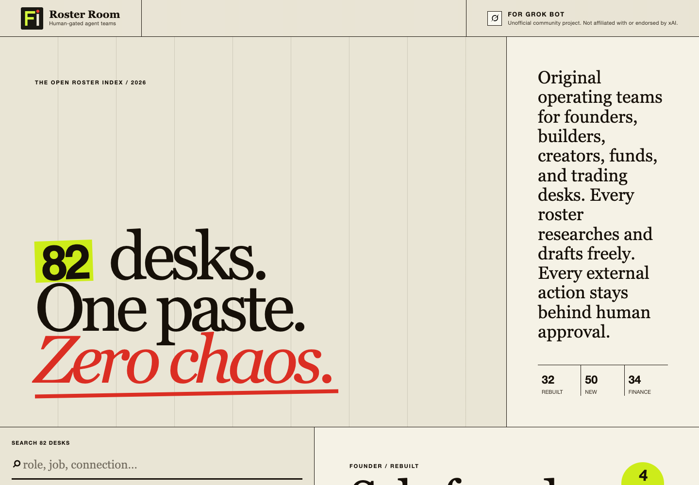

# Roster Room

**82 original, guarded team rosters ready to paste into Grok Bot.**

Roster Room is a public operating-team library for founders, builders, creators, professional services, investment firms, and trading desks. Pick a desk, inspect the roles and hard permission boundary, then copy the full setup, first job, or fallback kickoff.



> Unofficial community project. Not affiliated with or endorsed by xAI.

## What is inside

- **32 rebuilt desks** covering the practical jobs in the original Bot Teams catalog, rewritten from scratch with clearer ownership, stronger evidence requirements, safer failure behavior, and explicit approval gates.
- **50 new desks**, including 32 finance desks spanning CFO, FP&A, treasury, controllership, tax, private equity, venture capital, hedge funds, fundamental equity, global macro, quant research, systematic trading, execution, derivatives, credit, rates, FX, commodities, crypto, portfolio construction, risk, compliance, trade operations, and fund administration.
- **Three prompt artifacts per desk:** full team setup, first job, and manual-group fallback.
- Full-text search across desk names, roles, responsibilities, summaries, and connections.
- Lane and connection filters, shareable hash routes, keyboard support, mobile layout, and one-click copying.

## The safety contract

Every roster may read, research, analyze, organize, and draft. Every external side effect stays behind explicit human approval.

The global gate covers sending, publishing, spending, deleting, contacting people, changing permissions, modifying live records, committing code, and deploying. Finance desks additionally forbid placing or cancelling orders, moving money, changing custody instructions, submitting filings, making suitability decisions, and providing personalized investment advice.

Bots must report missing connections and failed teammate creation truthfully. They are explicitly forbidden from role-playing that a team or action exists.

## Run locally

```bash
npm install
npm run dev
```

Production checks:

```bash
npm test
npm run build
npm run preview
```

## Architecture

```text
src/data/             typed roster definitions and validation
src/prompts/          pure setup, first-job, and fallback generators
src/app/catalog.ts    search, filters, and slug resolution
src/app/render.ts     semantic dossier and directory rendering
src/app/controller.ts browser interaction and clipboard behavior
src/styles.css        responsive editorial visual system
```

The app is a static Vite + TypeScript build. It has no backend, accounts, analytics, tracking, or runtime API dependency.

## Add a roster

Use the `roster()` factory in `src/data/factory.ts`, choose an accountable lead and two to four specialists, give every role one clear ownership boundary, and write a measurable first job. The collection validator requires unique slugs, unique bot names inside a roster, and explicit approval limits.

Run the tests before opening a pull request:

```bash
npm test
npm run build
```

## Brand and trademark notice

The Grok logomark in `public/grok-logo.svg` is the unaltered dark logomark distributed in xAI's official Grok asset package. Source: [xAI Brand Guidelines](https://x.ai/legal/brand-guidelines). File SHA-256: `a127a7cd42b0450f7d3827a331b0730aab49fd99c3fe920d172475b9ffc83992`.

Grok, xAI, and their logos are trademarks of xAI. The logo and other third-party marks are excluded from this repository's MIT license grant. Roster Room is a separate, unofficial project and does not imply xAI endorsement, approval, or sponsorship.

## License

Original code and roster text are released under the [MIT License](LICENSE). Third-party marks remain the property of their respective owners.

